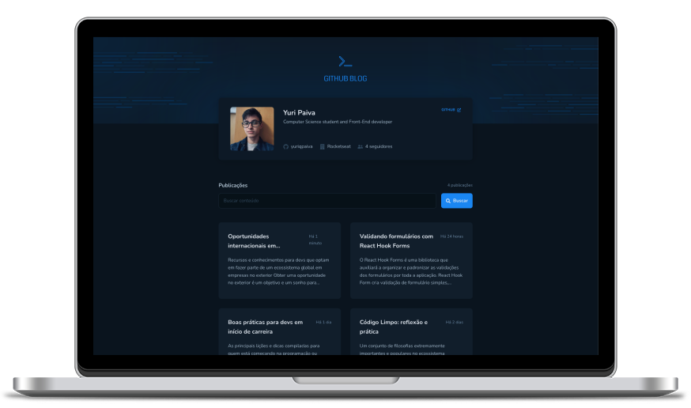

 

 

# Github Blog

 

  
  
  

  

 

## 🚀 Features

1. **Integration with Github Issues:** Automatically pulling issues from Github and converting them to blog posts.

2. **Display User Profile:** Displays user's profile with data coming from Github API

3. **Preview Posts:** The ability to display a list of preview posts on the home page, making it easy for users to browse and find interesting content.

4. **Full Post View:** Users can view the full content of a post by clicking on it.

5. **Search:** A search bar that allows users to search for specific posts.

6. **Responsive Design:** The site is designed to work well on desktop, tablet, and mobile devices.

 

## 🛠️ Technologies

This application is built using the following technologies:

- [React](https://reactjs.org/)
- [TypeScript](https://www.typescriptlang.org/)
- [Vite](https://vitejs.dev/)
- [React Hooks](https://reactjs.org/docs/hooks-intro.html)

 

## 🚀 Getting Started

Follow these steps to get started with the Timer Application:

1. Clone the repository to your local machine.

2. Install dependencies using the command `npm install`.

3. Start the development server using the command `npm run dev`.

4. In your browser, navigate to `http://localhost:5173` to access the application.

 

## 🚀 Creating a Production Build

To create a production build of the Timer Application, follow these steps:

1. Run the command `npm run build`.

2. The production-ready application will be generated in the `dist` directory.

3. Serve the production build using a server of your choice.

 

## 🤝 Contributing

Contributions to this project are welcome. To contribute, follow these steps:

1. Fork the repository.

2. Create a new branch.

3. Make your changes and commit them.

4. Push to the new branch.

5. Create a pull request.

 

## 📝 License

This project is licensed under the MIT License.
